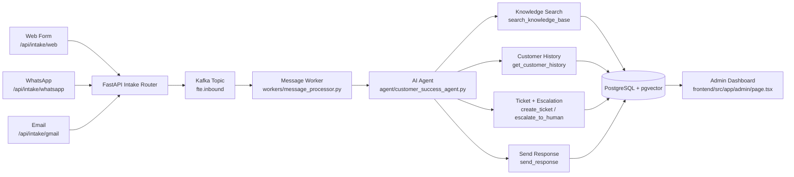

<a id="readme-top"></a>

<div align="center">
   
  <h1 align="center">CRM Digital FTE</h1>
  <p align="center">
    Autonomous multi-channel customer support platform with AI agent orchestration, async processing, and admin operations dashboard.
    <br />
    <a href="backend/api/main.py"><strong>Backend API</strong></a>
    ·
    <a href="frontend/src/app/admin/page.tsx"><strong>Admin Dashboard</strong></a>
    ·
    <a href="backend/workers/message_processor.py"><strong>Worker</strong></a>
    ·
    <a href="specs/customer-success-fte-spec.md"><strong>Spec</strong></a>
  </p>
   <p align="center">
      
      
      
      
      
      
   </p>
</div>

## Table Of Contents
- [About The Project](#about-the-project)
- [Application Workflow](#application-workflow)
- [Built With](#built-with)
- [Project Structure](#project-structure)
- [Getting Started](#getting-started)
- [Configuration](#configuration)
- [Run Locally](#run-locally)
- [API Endpoints](#api-endpoints)
- [Admin Operations](#admin-operations)
- [Testing](#testing)
- [Deployment](#deployment)
- [Roadmap](#roadmap)
- [Contributing](#contributing)

## About The Project
CRM Digital FTE is a production-style customer success automation platform that receives customer requests from web, WhatsApp, and email channels, processes them with an AI agent, stores history in PostgreSQL, and exposes a dark-theme admin dashboard for operations.

Core capabilities:
- Multi-channel intake routing and normalized event processing.
- AI agent workflow with knowledge search, customer history, ticketing, escalation, and response dispatch.
- Human-in-the-loop flow for escalated cases and handoff back to the agent with instructions.
- Manual admin data management for ticket status and conversation-level bulk deletion.

Primary implementation references:
- [backend/agent/customer_success_agent.py](backend/agent/customer_success_agent.py)
- [backend/agent/tools.py](backend/agent/tools.py)
- [backend/workers/message_processor.py](backend/workers/message_processor.py)
- [backend/api/routers/intake.py](backend/api/routers/intake.py)
- [backend/api/routers/admin.py](backend/api/routers/admin.py)
- [frontend/src/app/admin/page.tsx](frontend/src/app/admin/page.tsx)

<p align="right">(<a href="#readme-top">back to top</a>)</p>

## Application Workflow


Workflow sources:
- [backend/api/routers/intake.py](backend/api/routers/intake.py)
- [backend/workers/message_processor.py](backend/workers/message_processor.py)
- [backend/agent/tools.py](backend/agent/tools.py)
- [backend/database](backend/database)
- [frontend/src/app/admin/page.tsx](frontend/src/app/admin/page.tsx)

<p align="right">(<a href="#readme-top">back to top</a>)</p>

## Built With
Backend:
- [FastAPI](https://fastapi.tiangolo.com/)
- [SQLAlchemy Async](https://docs.sqlalchemy.org/en/20/orm/extensions/asyncio.html)
- [OpenAI Agents SDK](https://openai.github.io/openai-agents-python/)
- [Gemini (OpenAI-compatible endpoint)](https://ai.google.dev/)
- [PostgreSQL + pgvector](https://github.com/pgvector/pgvector)
- [Apache Kafka](https://kafka.apache.org/)

Frontend:
- [Next.js](https://nextjs.org/)
- [React](https://react.dev/)
- [TypeScript](https://www.typescriptlang.org/)
- [Tailwind CSS](https://tailwindcss.com/)

Infra and tooling:
- [Docker Compose](https://docs.docker.com/compose/)
- [Alembic](https://alembic.sqlalchemy.org/)
- [Pytest](https://docs.pytest.org/)

<p align="right">(<a href="#readme-top">back to top</a>)</p>

## Project Structure
Top-level map (clickable):
- [backend](backend)
- [frontend](frontend)
- [tests](backend/tests)
- [k8s](k8s)
- [specs](specs)
- [docker-compose.yml](docker-compose.yml)
- [AGENTS.md](AGENTS.md)

Backend key folders:
- [backend/api](backend/api) - API app entry and routers.
- [backend/agent](backend/agent) - agent model setup, prompts, tools.
- [backend/workers](backend/workers) - Kafka consumer and processing loop.
- [backend/database](backend/database) - ORM models and query modules.
- [backend/channels](backend/channels) - channel adapters for intake.
- [backend/integrations](backend/integrations) - Gmail integration and helper APIs.
- [backend/context](backend/context) - context injected into system prompt.

Frontend key folders:
- [frontend/src/app](frontend/src/app) - Next.js app routes.
- [frontend/src/app/admin](frontend/src/app/admin) - admin dashboard pages.

<p align="right">(<a href="#readme-top">back to top</a>)</p>

## Getting Started
### Prerequisites
- Python 3.10+
- Node.js 18+
- Docker + Docker Compose
- PostgreSQL database (local or managed)

### Installation
1. Clone repository and move to root.
2. Copy backend env template:
   - [backend/env.example](backend/env.example) -> `.env` in [backend](backend)
3. Install backend dependencies:
   - [backend/requirements.txt](backend/requirements.txt)
4. Install frontend dependencies:
   - [frontend/package.json](frontend/package.json)
5. Run migrations:
   - [backend/alembic](backend/alembic)

<p align="right">(<a href="#readme-top">back to top</a>)</p>

## Configuration
Backend environment file:
- Template: [backend/env.example](backend/env.example)
- Create runtime `.env` in [backend](backend)

Important variables:
- `DATABASE_URL`
- `GEMINI_API_KEY`
- `KAFKA_BOOTSTRAP_SERVERS`
- `KAFKA_INTAKE_TOPIC`
- `ADMIN_USERNAME`
- `ADMIN_PASSWORD`
- `GMAIL_CLIENT_ID`
- `GMAIL_CLIENT_SECRET`
- `GMAIL_REFRESH_TOKEN`
- `TWILIO_ACCOUNT_SID`
- `TWILIO_AUTH_TOKEN`

Frontend environment:
- Create runtime `.env.local` in [frontend](frontend) with `NEXT_PUBLIC_API_URL`

<p align="right">(<a href="#readme-top">back to top</a>)</p>

## Run Locally
Start infrastructure:
```bash
docker-compose up -d
```

Run backend API:
```bash
cd backend
python -m venv .venv
.\.venv\Scripts\activate
pip install -r requirements.txt
alembic upgrade head
uvicorn api.main:app --reload --port 8000
```

Run worker:
```bash
cd backend
.\.venv\Scripts\activate
python -m workers.message_processor
```

Run frontend:
```bash
cd frontend
npm install
npm run dev
```

Local URLs:
- Frontend: http://localhost:3000
- API health: http://localhost:8000/health
- API docs: http://localhost:8000/docs

<p align="right">(<a href="#readme-top">back to top</a>)</p>

## API Endpoints
Router definitions:
- Intake: [backend/api/routers/intake.py](backend/api/routers/intake.py)
- Admin: [backend/api/routers/admin.py](backend/api/routers/admin.py)
- Health: [backend/api/routers/health.py](backend/api/routers/health.py)

Main routes:
- `GET /health`
- `GET /ready`
- `POST /api/intake/web`
- `POST /api/intake/whatsapp`
- `POST /api/intake/gmail`
- `GET /api/admin/dashboard`
- `GET /api/admin/dashboard/activity`
- `GET /api/admin/tickets`
- `PATCH /api/admin/tickets/{ticket_id}/status`
- `POST /api/admin/tickets/{ticket_id}/reply`
- `POST /api/admin/tickets/{ticket_id}/handoff-to-agent`
- `GET /api/admin/history/conversations`
- `POST /api/admin/history/conversations/bulk-delete`

Admin auth dependency:
- [backend/api/deps.py](backend/api/deps.py)

<p align="right">(<a href="#readme-top">back to top</a>)</p>

## Admin Operations
Admin UI page:
- [frontend/src/app/admin/page.tsx](frontend/src/app/admin/page.tsx)

Current tabs:
- Dashboard: KPIs, trends, sentiment, channel health, logs.
- Assigned Tickets: reply workflow.
- Manage Data: ticket status update + filtered conversation bulk deletion.

<p align="right">(<a href="#readme-top">back to top</a>)</p>

## Testing
Backend tests:
- [backend/tests/test_agent.py](backend/tests/test_agent.py)
- [backend/tests/test_admin_api.py](backend/tests/test_admin_api.py)
- [backend/tests/test_channels.py](backend/tests/test_channels.py)
- [backend/tests/test_worker.py](backend/tests/test_worker.py)

Run tests:
```bash
cd backend
pytest tests/
```

<p align="right">(<a href="#readme-top">back to top</a>)</p>

## Deployment
Recommended free-friendly options for this architecture:
- Railway (multi-service friendly for API + worker + DB)
- Render (possible, but background + queue setup may need extra care)
- Oracle Always Free VM (best for full self-managed stack)

Helpful deployment docs in repo:
- [specs/deployment-guide-free.md](specs/deployment-guide-free.md)
- [specs/local-testing-guide.md](specs/local-testing-guide.md)
- [production](production)
- [k8s](k8s)

<p align="right">(<a href="#readme-top">back to top</a>)</p>

## Roadmap
- Add safer confirmation workflow for destructive bulk deletes.
- Add queue/worker observability panel in admin UI.
- Add richer channel SLA health logic and alerts.

Roadmap context:
- [specs/hackathon-completion-checklist.md](specs/hackathon-completion-checklist.md)
- [specs/discovery-log.md](specs/discovery-log.md)

<p align="right">(<a href="#readme-top">back to top</a>)</p>

## Contributing
Contributions are welcome.

Suggested flow:
1. Fork the project.
2. Create a feature branch.
3. Commit focused changes.
4. Run tests and lint.
5. Open a pull request.

Useful references:
- [guide.md](guide.md)
- [AGENTS.md](AGENTS.md)

<p align="right">(<a href="#readme-top">back to top</a>)</p>
